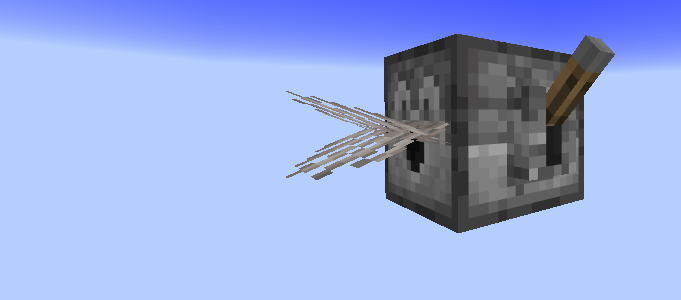
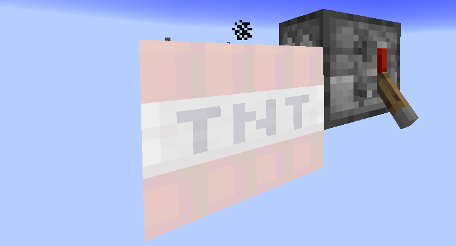
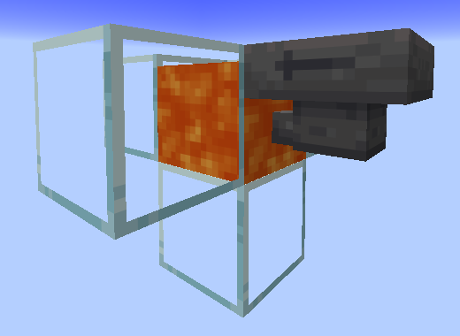

Since the gapples skyblock server runs on a Raspberry Pi, I decided to add some QOL features to reduce lag and improve performance.

## Dispenser Fan TNT Duper

Dispensers that dispense TNT if there's any dead coral fan placed right where the dispenser is facing at, the TNT dupes. This is to fix the vanilla inconsistent randomness from TNT dupers which can cause some accidents and to improve performance reducing ticking blocks and entities. You still need to unlock the coral fan tho, which you can obtain by bone mealing water in a warm ocean biome or by killing tropical fishes. For more information about mob drops check [Custom Loot Tables](/features/custom-loot-tables/).

## Hopper Lava Void System

Hoppers pointing right into lava voids items automatically.

