## Enchanted Golden Apple Recipe

The old Gapple (Notch Apple) from pre 1.9 is back.

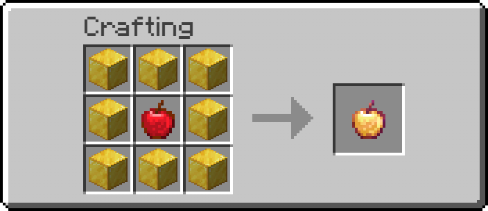

Notch apples effects are also pre 1.9:

| Potion Effect | Duration
| :--- | :--- |
| **Absorption I** | 2 mins |
| **Regeneration V** | 30 sec |
| **Resistance I** | 5 mins |
| **Fire Resistance I** | 5 mins |

---

## Netherite Gear (Template-Free)

Netherite gear can be crafted directly on a Crafting Table using Netherite Ingots without requiring Smithing Templates or diamond base gear. You can craft all netherite gear the same way you would craft any other type of armor or tool. For more information about how to obtain netherite ingots, check [Custom Loot Tables](/features/custom-loot-tables).

### Netherite Recipes

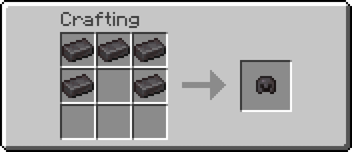

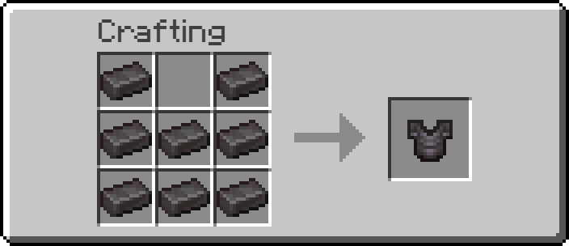

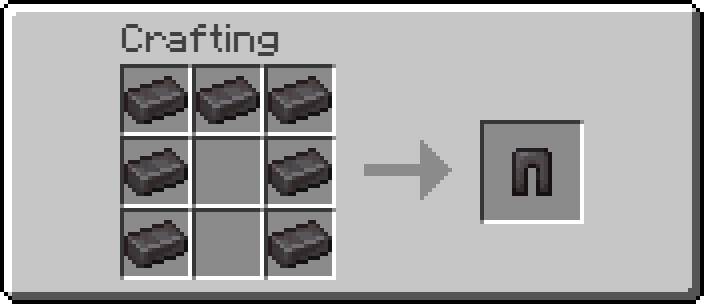

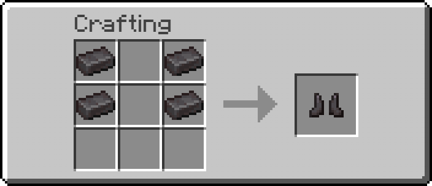

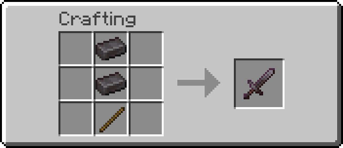

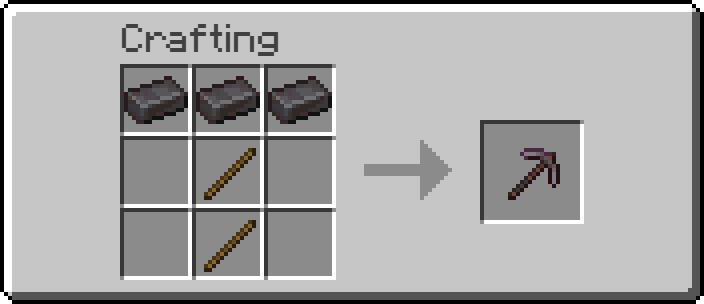

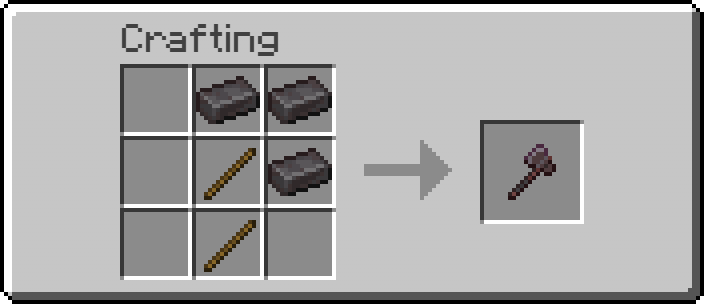

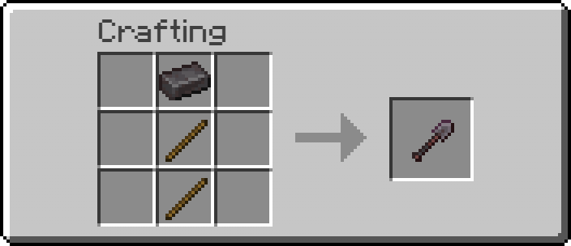

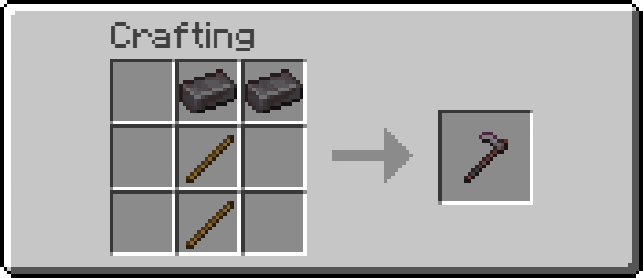

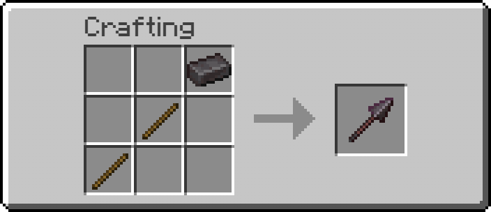