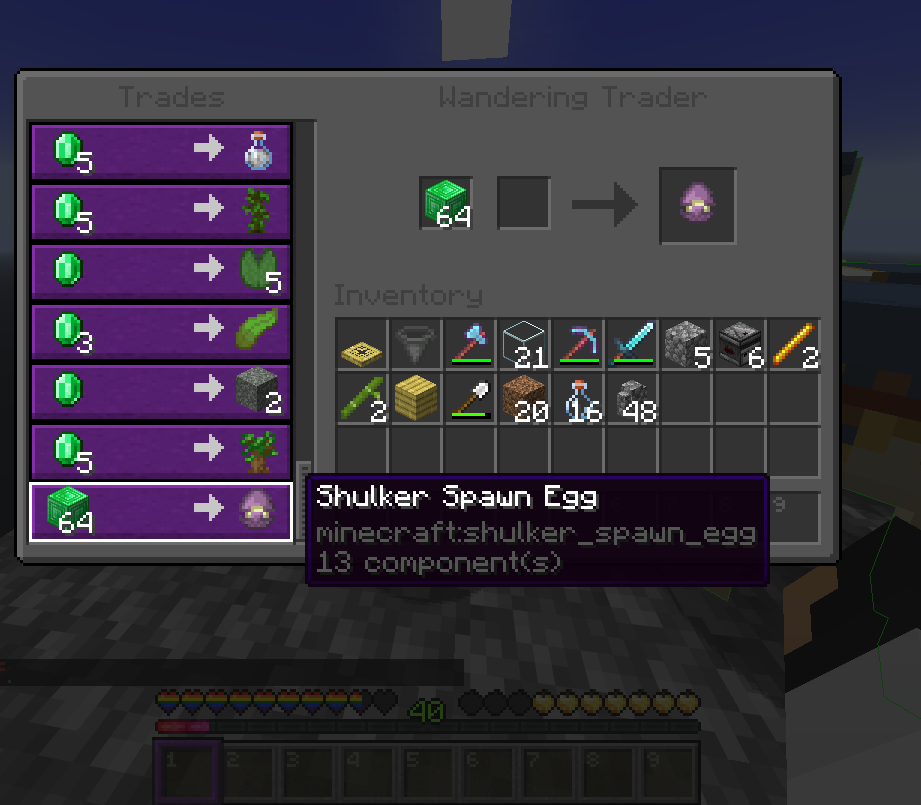

## Custom Mob Drops

Loot drops are calculated on entity death. Looting enchantments on the killer's main-hand weapon apply a bonus percentage roll per level.

| Mob | Drop | Base Chance | Looting Bonus | Notes |
| :--- | :--- | :---: | :---: | :--- |
| **Husk** | Sand | 100% | +33.3% / lvl | Drops 1–2 sand (Looting III) |
| **Shulker** | Shulker Shell | 100% | +8.33% / lvl | Guaranteed shulker shell drop |
| **Trader Llama** | Bedrock | 0.01% | +0.03% / lvl | Enables renewable bedrock for farms |
| **Tropical Fish** | Coral Fan | 25% | — | Random coral fan variant |
| **Wither** | Netherite Ingot | 100% | — | Primary source for Netherite* |
| **Illusioner** | Amethyst Shard | 100% | +33.0% / lvl | Guaranteed drop |
| **Allay** | Jukebox | 100% | — | Guaranteed drop |
| **Mooshroom** | Mycelium | 1% | — | Enables renewable mycelium |
| **Witch** | Nether Wart | 1% | — | Enables renewable nether wart |

:::note
*Killing Withers is the only way to obtain Netherite. But netherite gear and tools cannot be crafted the vanilla way. For more information check [Custom Crafting & Items](/features/custom-crafting-and-items/).
:::

---

## Wandering Trader Special Trade

When a Wandering Trader spawns, there is a **10% chance** a shulker spawn egg is added to its trades.

- **Cost**: 64 Emerald Blocks
- **Result**: 1 Shulker Spawn Egg with a randomized color.

With a shulker spawn egg you can make a shulker farm to get shulker boxes. For more information on how to dupe shulkers check https://minecraft.wiki/w/Shulker#Post-generation
