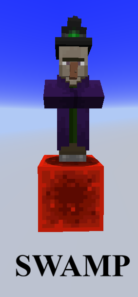
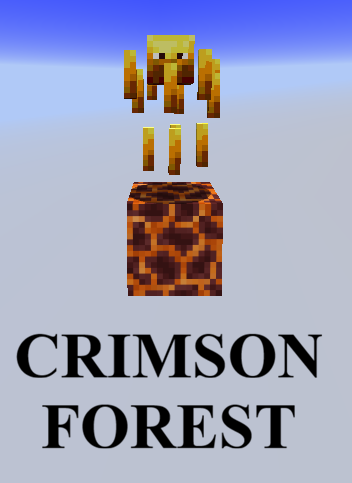
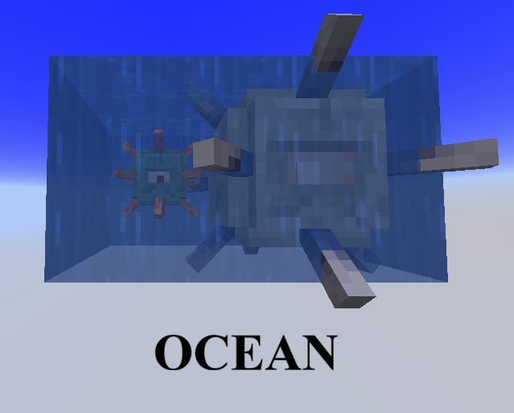
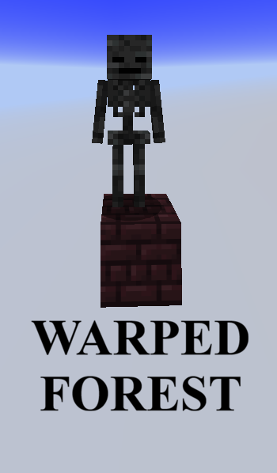
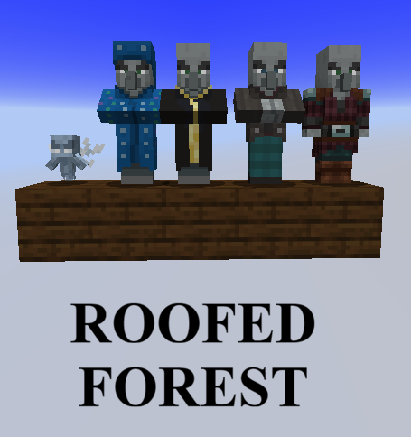
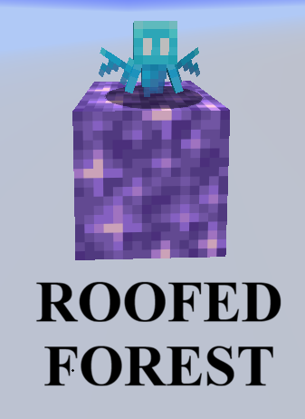
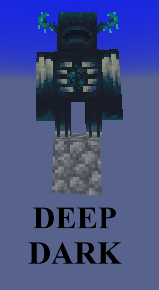
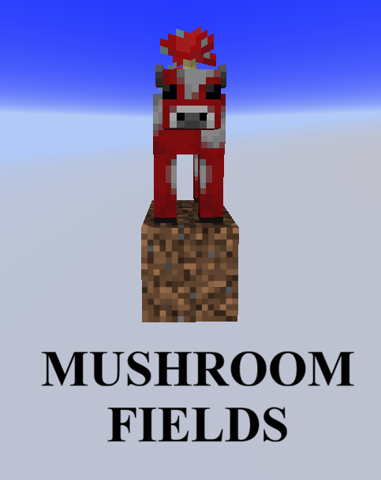

## Overview

Many mobs spawning are injected directly into vanilla NMS biome spawn pools without replacing vanilla mob pools. In order to trigger spawning for specific mobs in skyblock, players must meet explicit block and biome requirements. 
For example, witches spawn sometimes naturally anywhere, but in gapples skyblock, the witches spawn rate is highly increased in the swamp biome on top of redstone blocks.

---

## Mob Spawning Conditions

*(Note: Mooshroom block requirement is Coarse Dirt)*

## Husk Skylight Bypass

Vanilla Husks strictly require direct skylight access (`canSeeSky`). The server overrides this requirement to allow them to spawn in the dark, to promote players building sand farms.

---

## Biome Spawn Exclusions

Certain biomes have vanilla mob pools stripped to ensure custom mob farm efficiency:

- **Swamp and Roofed Forests**: Excludes vanilla `zombie`, `skeleton`, `enderman`, `creeper`, `spider`, and `zombie_villager` so that your witch and illagers farm go crazy.
